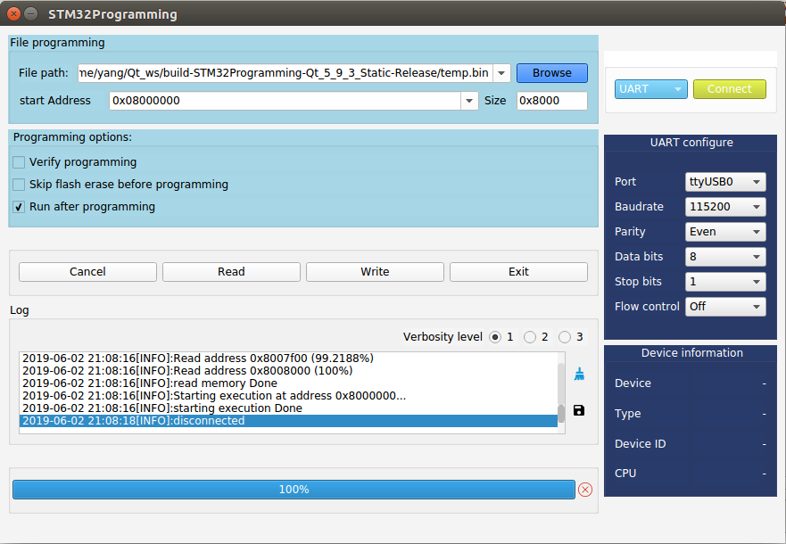

STM32 bootloader Read Writer for windows and unix
##Release 1.1.0 

    

===================
Build Instructions:
===================
## Dependencies & Prerequisites
1. [Qt5](http://qt-project.org/) (or higher)  

Short Version:
1. Install the Qt Full SDK and use QT Creator to build.  

